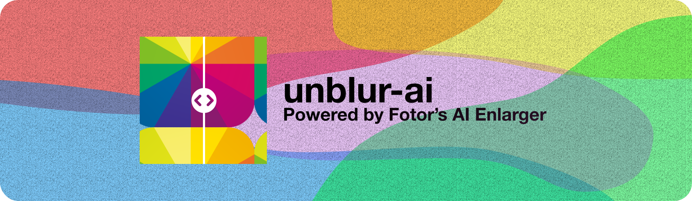
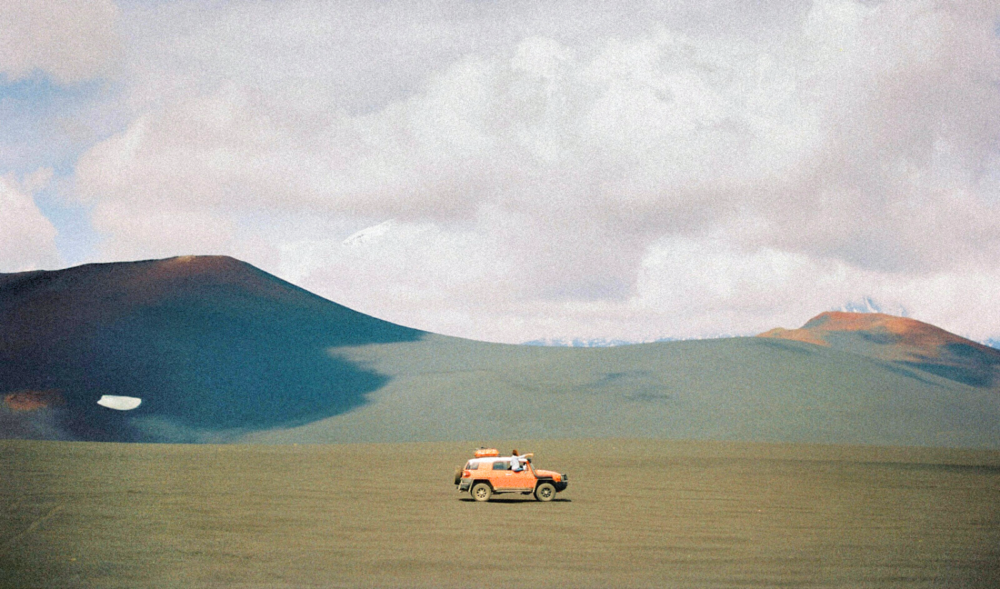

<picture>
  <source media="(prefers-color-scheme: dark)" srcset="./assets/banner@dark.svg">
  <source media="(prefers-color-scheme: light)" srcset="./assets/banner@light.svg">
  
</picture>
<h1 align="center">
    Unblur Photos with Fotor
</h1>

| Before                                | After                               |
| ------------------------------------- | ----------------------------------- |
|  |  |


## Usage
Use in 2 easy steps:

### 1. Download

With `pnpm`:

```bash
pnpm add unblur-ai
```

With `npm`:

```bash
npm i unblur-ai
```

### 2. Use

```javascript
import unblur from "unblur-ai";

unblur("./path/to/original.png", "./path/to/destination");
```
